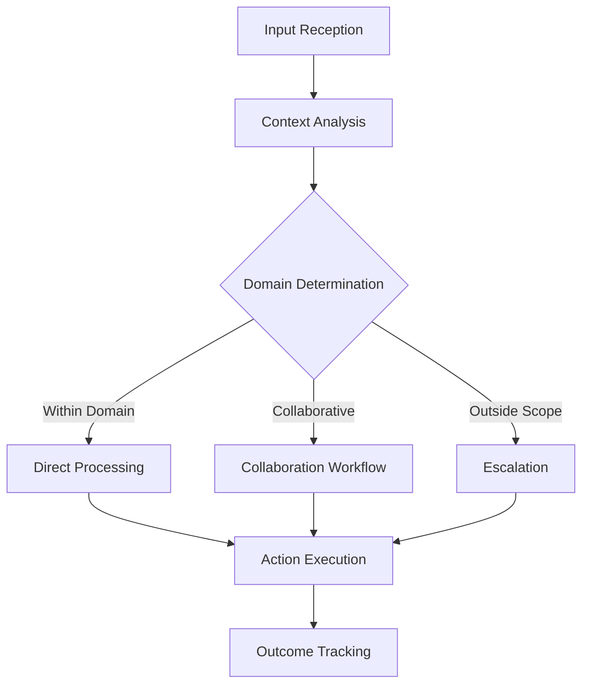
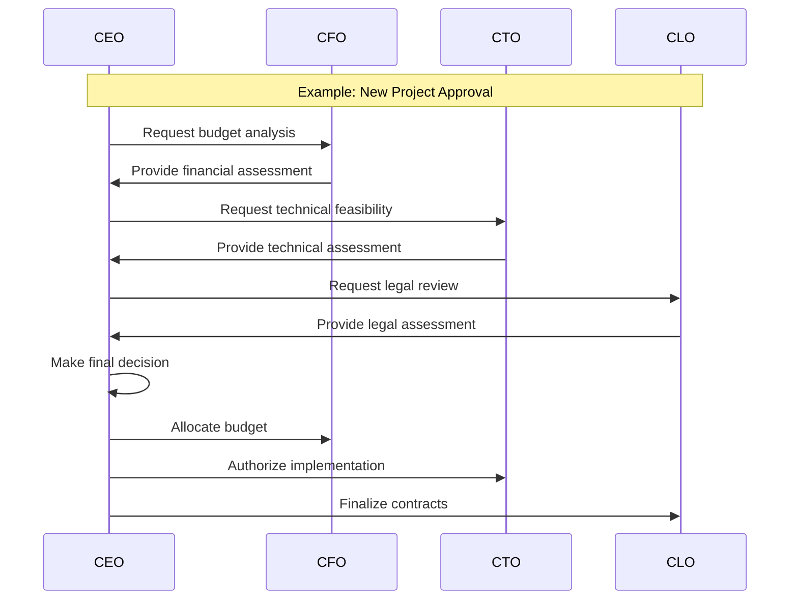

# Agent Model

## Overview

Sadellari Agents implements a hierarchical agent model where each agent represents an executive role with specific responsibilities, domain knowledge, and decision-making authority. The system is designed to distribute decision-making while maintaining overall alignment with company strategy.

## Core Principles

1. **Autonomy within Domains:** Each agent has full decision-making authority within its specific domain.
2. **Hierarchical Authority:** The CEO agent has final authority on strategic decisions and can override other agents when necessary.
3. **Collaborative Decision-Making:** Complex decisions involve multiple agents providing input through structured workflows.
4. **Continuous Learning:** Agents improve their decision-making based on outcomes and feedback.

## Agent Structure

Each agent follows a common structure:

- **Knowledge Base:** Domain-specific information and heuristics
- **Decision Engine:** Logic for evaluating options and making decisions
- **Communication Interface:** Methods for interacting with other agents and humans
- **Memory System:** Storage of past interactions and decisions

## Agent Implementation

All agents implement the common `IAgent` interface, which provides:

```typescript
interface IAgent {
  handleMessage(message: string): Promise<void>;
  processDecision(context: DecisionContext): Promise<Decision>;
  requestInformation(query: Query, targetAgent: AgentType): Promise<Response>;
  reportStatus(): AgentStatus;
}
```

Each specific agent (CEO, CFO, etc.) extends this interface with specialized methods and properties relevant to their domain.

## Agent Roles and Responsibilities

### CEO Agent

The CEO Agent serves as the strategic leader of the agent system with responsibilities including:

- Setting overall company direction and priorities
- Making final decisions on major strategic initiatives
- Delegating domain-specific tasks to appropriate agents
- Coordinating multi-agent workflows for complex decisions
- Communicating high-level updates to stakeholders

### CFO Agent

The CFO Agent handles financial management with responsibilities including:

- Budget allocation and oversight
- Financial analysis and reporting
- Cash flow management
- Investment decisions and treasury operations
- Cost-benefit analysis for strategic initiatives

### CTO Agent

The CTO Agent manages technical matters with responsibilities including:

- Technology infrastructure decisions
- Technical implementation planning
- Resource allocation for development
- Technical risk assessment
- Innovation and technology roadmap planning

### CLO Agent

The CLO Agent oversees legal and compliance matters with responsibilities including:

- Legal risk analysis
- Compliance monitoring
- Contract review and management
- Regulatory tracking and adaptation
- Legal documentation and record-keeping

## Decision Flow



1. **Input Reception:** Agent receives a message or event
2. **Context Analysis:** Agent evaluates the content and determines relevance
3. **Decision Determination:**
   - If within the agent's domain: processes directly
   - If requires other agents: initiates a collaboration workflow
   - If outside scope: escalates to appropriate agent
4. **Action Execution:** Agent implements the decision
5. **Outcome Tracking:** Agent records the decision and monitors results

## Collaboration Patterns



## Current Implementation Status

- **CEO Agent:** Basic implementation with message handling and simple decision logic
- **CFO Agent:** Interface defined, implementation in progress
- **CTO Agent:** Planned, not yet implemented
- **CLO Agent:** Planned, not yet implemented
- **Inter-agent Communication:** Basic structure defined, full implementation pending

## Future Development

Future development will enhance the agent model with:

1. **Learning Capabilities:** Improving decision quality over time
2. **Advanced Collaboration:** More sophisticated workflows for complex decisions
3. **Enhanced Domain Knowledge:** Deeper expertise in each agent's domain
4. **Memory Systems:** Long-term storage of decisions and outcomes
