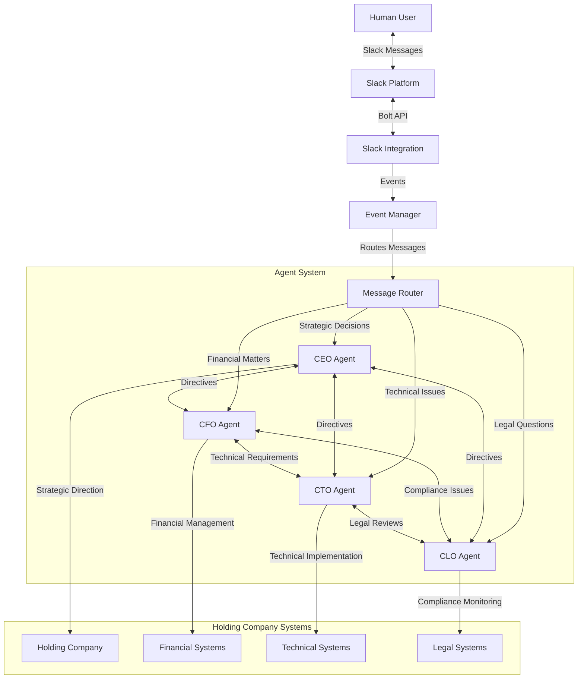
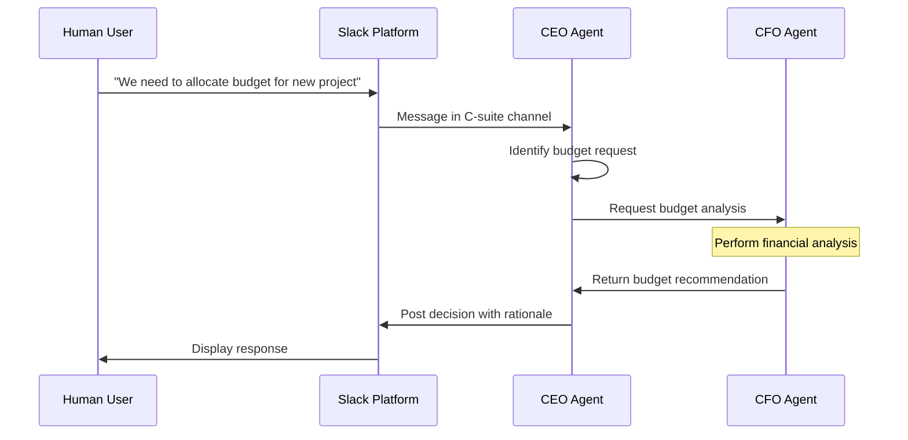

# System Architecture Overview

## Introduction

Sadellari Agents implements an event-driven, multi-agent architecture where specialized AI agents collaborate to manage business operations. This document outlines the high-level system architecture, component relationships, and communication patterns.

## System Components

### Core Components

### Key Components

1. **Slack Integration**
   - Handles all communication with the Slack API
   - Processes incoming messages and events
   - Manages message routing to appropriate agents
   - Provides a unified interface for sending messages

2. **Agent System**
   - CEO Agent: Strategic leadership and final decision authority
   - CFO Agent: Financial management and reporting
   - CTO Agent: Technical implementation and infrastructure
   - CLO Agent: Legal compliance and risk management

3. **Message Router**
   - Determines which agent should receive which message
   - Implements rules-based routing for message categorization
   - Manages message priority and handling order

4. **Event Manager**
   - Processes system events and schedules actions
   - Maintains the event queue and dispatches events to agents
   - Handles event-based triggers for automated actions

## Communication Patterns

### Inter-Agent Communication Flow

### Message Types

1. **Direct Mentions**: Messages directly addressing an agent by @mention
2. **Channel Messages**: Messages posted in monitored channels
3. **Direct Messages**: Private messages sent to specific agents
4. **Inter-Agent Requests**: Structured data requests between agents
5. **Inter-Agent Notifications**: Status updates and information sharing

## Data Flow

1. **Input Processing**:
   - Messages arrive via Slack Integration
   - Messages are parsed and categorized
   - Context is enriched with relevant metadata

2. **Decision Processing**:
   - Agents apply domain-specific logic
   - Collaborative decisions involve multiple agents
   - Decisions follow predefined workflows based on type

3. **Output Generation**:
   - Responses are formatted for the target audience
   - Multi-part responses may be coordinated across agents
   - Results are delivered via Slack Integration

## System Boundaries

The Sadellari Agents system interfaces with:

1. **Slack Workspace**: Primary user interface and communication channel
2. **Holding Company Systems**: Business systems that the agents interact with
3. **External APIs**: For data enrichment and additional capabilities
4. **Persistent Storage**: For maintaining agent state and historical context

## Technical Implementation

The system is implemented using:

- **TypeScript**: For type-safe implementation
- **Node.js**: Runtime environment
- **Slack Bolt Framework**: For Slack integration
- **Event Emitters**: For event-driven architecture
- **Interfaces**: For enforcing agent contracts

## Current Limitations and Future Extensions

1. **Current Limitations**:
   - Basic implementation of inter-agent communication
   - Limited decision-making capabilities
   - Incomplete implementation of agent specializations

2. **Planned Extensions**:
   - Enhanced natural language processing
   - Decision history and learning from outcomes
   - Integration with additional business systems
   - Advanced collaborative decision workflows
